# 🤖 Agentic AI リスク評価ツール

議事録テキストから Agentic AI アプリケーションに関する情報を自動抽出し、**EU AI Act（Regulation (EU) 2024/1689）** に基づくリスクレベルを判定する Web アプリです。

---

## 概要 / Overview

会議の議事録ファイル（Word・PDF・テキスト）をアップロードするだけで、以下を自動実行します：

1. **情報抽出** — GPT-4o が議事録から Agentic AI アプリの概要・利用者・データ種別などを抽出
2. **内容確認・編集** — 抽出結果を UI 上で手動修正可能
3. **リスク判定** — EU AI Act 第5条・第6条・第50条に基づいてリスクレベルを自動判定
4. **結果表示** — リスクレベルと詳細な判定根拠を表示

---

## スタック / Tech Stack

| レイヤー | 技術 |
|----------|------|
| UI | Gradio（Python） |
| AI ワークフロー | LangGraph + LangChain |
| LLM | OpenAI GPT-4o |
| ファイル解析 | python-docx（Word）、pypdf（PDF）、plain text |
| バックエンド API | Express 5（Node.js）、Drizzle ORM、PostgreSQL |
| パッケージ管理 | pnpm workspaces、TypeScript 5.9 |

---

## ディレクトリ構成 / Directory Structure

```
.
├── artifacts/
│   ├── ai-risk-app/          # Gradio UI + LangGraph ワークフロー（Python）
│   │   ├── app.py            # UI エントリーポイント
│   │   ├── graph.py          # LangGraph 定義（extract_graph / risk_graph）
│   │   └── file_parser.py    # ファイルパーサー（docx / pdf / txt）
│   ├── api-server/           # Express バックエンド API（Node.js）
│   └── mockup-sandbox/       # デザインプレビュー用サンドボックス
├── lib/
│   └── api-spec/
│       └── openapi.yaml      # OpenAPI 仕様
├── .env.example              # 必要な環境変数のサンプル
└── pnpm-workspace.yaml       # pnpm ワークスペース設定
```

---

## セットアップ手順 / Getting Started

### 前提条件 / Prerequisites

- **Python 3.11+**
- **Node.js 20+**
- **pnpm 9+**
- **PostgreSQL**（API サーバーを使う場合）
- **OpenAI API キー**

### 1. リポジトリのクローン

```bash
git clone <repository-url>
cd <repository-name>
```

### 2. 環境変数の設定

`.env.example` をコピーして `.env` を作成し、値を設定してください：

```bash
cp .env.example .env
```

次のセクション「[環境変数一覧](#環境変数一覧--environment-variables)」を参照してください。

### 3. Python 依存パッケージのインストール

```bash
pip install gradio langgraph langchain langchain-openai python-docx pypdf
```

### 4. Node.js 依存パッケージのインストール

```bash
pnpm install
```

### 5. データベースのセットアップ（オプション）

API サーバーを使用する場合は PostgreSQL データベースを作成し、`DATABASE_URL` を `.env` に設定してください。スキーマの適用は `lib/db` パッケージのマイグレーションスクリプトで行います（プロジェクト固有の手順に従ってください）。

---

## 起動方法 / Running the App

### AI リスク評価 UI（Gradio）

```bash
python artifacts/ai-risk-app/app.py
```

または環境変数でポートを指定：

```bash
PORT=8000 python artifacts/ai-risk-app/app.py
```

ブラウザで `http://localhost:8000` にアクセスしてください。

### API サーバー（オプション）

`PORT` 環境変数が必須です（未設定の場合は起動に失敗します）：

```bash
PORT=8080 pnpm --filter @workspace/api-server run dev
```

API は `http://localhost:8080/api` で起動します。

### TypeScript 型チェック

```bash
pnpm run typecheck
```

---

## 環境変数一覧 / Environment Variables

| 変数名 | 必須 | 説明 |
|--------|------|------|
| `OPENAI_API_KEY` | ✅ 必須 | OpenAI API キー（GPT-4o 使用） |
| `DATABASE_URL` | API 使用時 | PostgreSQL 接続文字列 |
| `PORT` | 任意 | UI サーバーのポート番号（デフォルト: `8000`） |

---

## 使い方 / Usage

1. **ファイルアップロード** — `.docx`・`.pdf`・`.txt` 形式の議事録ファイルを選択
2. **情報抽出** — 「📄 情報を抽出する」ボタンをクリック（GPT-4o が自動解析）
3. **内容確認・編集** — 抽出された6項目を確認し、必要に応じて編集
4. **リスク評価** — 「⚖️ リスク評価を実行する」ボタンをクリック
5. **結果確認** — リスクレベルと EU AI Act の根拠条文を確認

### リスクレベルの分類

| アイコン | レベル | 説明 |
|----------|--------|------|
| 🚫 | 禁止（Prohibited） | EU AI Act 第5条により禁止される実践 |
| 🔴 | 高リスク（High-Risk） | 第6条により高リスク AI システムに分類 |
| 🟠 | 透明性義務あり | 第50条の透明性義務が適用 |
| 🟡 | 限定リスク | 特定の義務はあるが高リスクには非該当 |
| 🟢 | 最小リスク | 規制上の義務がほとんどない |

---

## アーキテクチャ / Architecture

```
議事録ファイル
    │
    ▼
file_parser.py ── テキスト抽出（docx / pdf / txt）
    │
    ▼
extract_graph（LangGraph）── GPT-4o で6項目を抽出
    │
    ▼
Gradio UI ── ユーザーが内容を確認・編集
    │
    ▼
risk_graph（LangGraph）── EU AI Act に基づきリスク判定
    │
    ▼
判定結果（リスクレベル + 根拠条文）
```

- 抽出グラフ・リスク評価グラフを **独立した LangGraph** として分離することで、ステップ間のユーザー編集を可能にしています。
- EU AI Act **第6条**を主な判定根拠とし、第5条・第50条も補助的に参照するプロンプト設計です。

---

## システムフローチャート / System Flowchart

LLMサービスとのデータ受け渡しを含む詳細なフローチャートです。

> **他ツールへのインポート**
> - **Mermaid Live**: https://mermaid.live にコードを貼り付け
> - **Excalidraw**: `+` → `Mermaid` → コードを貼り付け

```mermaid
flowchart TD
    classDef userBtn  fill:#0f4c81,color:#fff,stroke:#0a3560,rx:6
    classDef llmBox   fill:#10a37f,color:#fff,stroke:#0a7a5f
    classDef store    fill:#7c3aed,color:#fff,stroke:#5b21b6
    classDef proc     fill:#f1f5f9,color:#1e293b,stroke:#94a3b8
    classDef out      fill:#fef9c3,color:#1e293b,stroke:#fbbf24

    %% ══════════════════════════════════════════════════════════
    %%  Phase 0 : EU AI Act RAG ベクトルDB 構築
    %% ══════════════════════════════════════════════════════════
    BTN0(["🔄 EU AI Actの情報を更新する\nボタンクリック"]):::userBtn

    subgraph RAG_BUILD["　Phase 0 ─ RAGベクトルDB構築　vectorstore.py"]
        direction TB
        WEB["🌐 httpx.AsyncClient\narticlesAIintelligenceact.eu/article/1/ 〜 /article/113/\n並列取得 (asyncio.Semaphore=20)\nHTMLタグ除去 → プレーンテキスト"]:::proc

        SPLIT["✂️ RecursiveCharacterTextSplitter\nchunk_size = 800 chars\nchunk_overlap = 150 chars\n→ ドキュメント群 (langchain Document)"]:::proc

        EMBED[["☁️ OpenAI API\nモデル: text-embedding-3-small\n─────────────────────────\nInput : テキストチャンク (str)\nOutput: 埋め込みベクトル (float[])×チャンク数"]]:::llmBox

        FAISS_DB[("🗂️ FAISS Index\nin-memory +\n/tmp/eu_ai_act_faiss/\n(index.faiss / index.pkl)")]:::store

        WEB -->|"条文テキスト\n[Article N] ...\n(113記事分結合)"| SPLIT
        SPLIT -->|"chunksリスト"| EMBED
        EMBED -->|"ベクトル + テキスト"| FAISS_DB
    end

    BTN0 --> WEB

    %% ══════════════════════════════════════════════════════════
    %%  Phase 1 : 議事録アップロード → 情報抽出
    %% ══════════════════════════════════════════════════════════
    BTN1(["📁 議事録ファイルを選択\n+ 情報を抽出するボタン"]):::userBtn

    subgraph EXTRACT_FLOW["　Phase 1 ─ 情報抽出　LangGraph: extract_graph　( START → extract → END )"]
        direction TB
        PARSE["📂 file_parser.parse_file()\n.docx → python-docx\n.pdf  → pypdf (PdfReader)\n.txt  → plain read\n→ minutes_text : str"]:::proc

        INIT_STATE["AppState 初期化\n{ minutes_text: str,\n  extracted: None,\n  edited: None,\n  eu_ai_act_text: None,\n  risk: None,\n  error: None }"]:::proc

        GPT4O_E[["☁️ OpenAI API  ─  GPT-4o / temperature=0\n──────────────────────────────────────────────\nSystemMessage:\n  『議事録から6項目をJSONで抽出せよ』\n  (EXTRACT_SYSTEM プロンプト)\n\nHumanMessage:\n  以下の議事録テキストを解析してください:\n  {minutes_text}\n──────────────────────────────────────────────\nResponse (JSON):\n  { overview, users, data_subjects,\n    input_data_categories,\n    output_data_categories,\n    output_purposes }"]]:::llmBox

        EXTRACTED["ExtractedInfo (TypedDict)\n{ overview             : str\n  users                : str\n  data_subjects        : str\n  input_data_categories: str\n  output_data_categories: str\n  output_purposes      : str }"]:::out

        PARSE --> INIT_STATE --> GPT4O_E
        GPT4O_E -->|"JSON.parse → ExtractedInfo"| EXTRACTED
    end

    BTN1 --> PARSE
    EXTRACTED -->|"各フィールドを Textbox に表示"| EDIT

    EDIT(["✏️ ユーザーが内容を\n確認・編集"]):::userBtn

    %% ══════════════════════════════════════════════════════════
    %%  Phase 2 : リスク評価
    %% ══════════════════════════════════════════════════════════
    BTN2(["⚖️ リスク評価を実行する\nボタンクリック"]):::userBtn
    EDIT --> BTN2

    subgraph RISK_FLOW["　Phase 2 ─ リスク評価　LangGraph: risk_graph　( START → fetch_eu_ai_act → risk_assess → END )"]
        direction TB

        subgraph NODE1["Node 1 : fetch_eu_ai_act_node"]
            MQ["マルチクエリ生成 (5クエリ)\n① アプリ文脈クエリ (6フィールド結合)\n② Art.5 prohibited AI practices\n③ Art.6 high-risk classification rules\n④ Art.50 transparency obligations\n⑤ high-risk conformity assessment"]:::proc

            FS[("🗂️ FAISS.similarity_search\nk = 6件 × 5クエリ\n→ 最大30件取得・重複除去\n(set による content dedup)")]:::store

            RAG_TXT["eu_ai_act_text : str\n取得条文チャンクを\n'---' 区切りで結合"]:::out

            MQ -->|"クエリ文字列"| FS
            FS -->|"関連条文チャンク群"| RAG_TXT
        end

        subgraph NODE2["Node 2 : risk_assess_node"]
            GPT4O_R[["☁️ OpenAI API  ─  GPT-4o / temperature=0\n──────────────────────────────────────────────\nSystemMessage:\n  RISK_SYSTEM_TEMPLATE\n  ・RAG取得条文テキスト (eu_ai_act_text) を埋込\n  ・判定ルール: Art.5 → 禁止\n               Art.6 → 高リスク\n               Art.50 → 透明性義務\n  ・条文テキスト以外の知識禁止\n\nHumanMessage:\n  概要説明文: {overview}\n  利用者: {users}\n  Data Subject: {data_subjects}\n  入力カテゴリ: {input_data_categories}\n  出力カテゴリ: {output_data_categories}\n  出力目的: {output_purposes}\n──────────────────────────────────────────────\nResponse (JSON):\n  { risk_level: str,\n    risk_basis: str }"]]:::llmBox

            RISK_RES["RiskAssessment (TypedDict)\n{ risk_level : str  ← 禁止 / 高リスク / 透明性義務\n                       / 限定リスク / 最小リスク\n  risk_basis  : str  ← 条文引用付き判定根拠 }"]:::out

            GPT4O_R -->|"JSON.parse → RiskAssessment"| RISK_RES
        end

        RAG_TXT --> GPT4O_R
    end

    BTN2 -->|"edited ExtractedInfo\n(6フィールド)"| MQ
    FAISS_DB -.->|"インデックス参照"| FS

    RISK_RES -->|"Markdown で結果表示"| RESULT_MD["📊 リスクレベル + 判定根拠\nMarkdown 表示"]:::out

    %% ══════════════════════════════════════════════════════════
    %%  Phase 3 : PDF レポート生成
    %% ══════════════════════════════════════════════════════════
    BTN3(["📥 レポートをダウンロード\nボタンクリック"]):::userBtn
    RESULT_MD --> BTN3

    subgraph PDF_FLOW["　Phase 3 ─ PDFレポート生成　pdf_report.py"]
        direction TB
        GEN["generate_pdf()\nfpdf2 (FPDF クラス継承)\nNotoSansJP-Regular/Bold.ttf\n─────────────────\n① タイトルブロック\n② リスクレベルバッジ (色分け)\n③ アプリケーション情報 (6フィールド)\n④ 判定根拠 (条文引用)\n⑤ 出典 URL フッター"]:::proc

        TMP["/tmp/eu_ai_act_risk_report_<uuid>.pdf"]:::out

        DL["gr.HTML\n<a href='/file={path}' download>\n  📄 ファイル名　← クリックしてDL\n</a>\n(Gradio allowed_paths=['/tmp'])"]:::out

        GEN --> TMP --> DL
    end

    BTN3 -->|"report_state\n{ risk_level, risk_basis,\n  overview, users,\n  data_subjects, input_cats,\n  output_cats, purposes }"| GEN
```

> - **Draw.io**: Extras → Edit Diagram → `<mermaid>` タグで囲んで貼り付け



---

## 参照 / References

- [EU AI Act — Regulation (EU) 2024/1689](https://eur-lex.europa.eu/legal-content/EN/TXT/?uri=CELEX:32024R1689)
- [LangGraph Documentation](https://langchain-ai.github.io/langgraph/)
- [Gradio Documentation](https://www.gradio.app/docs/)
- [OpenAI API Documentation](https://platform.openai.com/docs)

---

## ライセンス / License

MIT License
