# Agentic AI リスク評価ツール — システムフローチャート

> **インポート方法**
> - **Mermaid Live**: https://mermaid.live → コードを貼り付け
> - **Excalidraw**: `+` → `Mermaid` → コードを貼り付け

```mermaid
flowchart TD
    classDef userBtn  fill:#0f4c81,color:#fff,stroke:#0a3560,rx:6
    classDef llmBox   fill:#10a37f,color:#fff,stroke:#0a7a5f
    classDef store    fill:#7c3aed,color:#fff,stroke:#5b21b6
    classDef proc     fill:#f1f5f9,color:#1e293b,stroke:#94a3b8
    classDef out      fill:#fef9c3,color:#1e293b,stroke:#fbbf24

    %% ══════════════════════════════════════════════════════════
    %%  Phase 0 : EU AI Act RAG ベクトルDB 構築
    %% ══════════════════════════════════════════════════════════
    BTN0(["🔄 EU AI Actの情報を更新する\nボタンクリック"]):::userBtn

    subgraph RAG_BUILD["　Phase 0 ─ RAGベクトルDB構築　vectorstore.py"]
        direction TB
        WEB["🌐 httpx.AsyncClient\narticlesAIintelligenceact.eu/article/1/ 〜 /article/113/\n並列取得 (asyncio.Semaphore=20)\nHTMLタグ除去 → プレーンテキスト"]:::proc

        SPLIT["✂️ RecursiveCharacterTextSplitter\nchunk_size = 800 chars\nchunk_overlap = 150 chars\n→ ドキュメント群 (langchain Document)"]:::proc

        EMBED[["☁️ OpenAI API\nモデル: text-embedding-3-small\n─────────────────────────\nInput : テキストチャンク (str)\nOutput: 埋め込みベクトル (float[])×チャンク数"]]:::llmBox

        FAISS_DB[("🗂️ FAISS Index\nin-memory +\n/tmp/eu_ai_act_faiss/\n(index.faiss / index.pkl)")]:::store

        WEB -->|"条文テキスト\n[Article N] ...\n(113記事分結合)"| SPLIT
        SPLIT -->|"chunksリスト"| EMBED
        EMBED -->|"ベクトル + テキスト"| FAISS_DB
    end

    BTN0 --> WEB

    %% ══════════════════════════════════════════════════════════
    %%  Phase 1 : 議事録アップロード → 情報抽出
    %% ══════════════════════════════════════════════════════════
    BTN1(["📁 議事録ファイルを選択\n+ 情報を抽出するボタン"]):::userBtn

    subgraph EXTRACT_FLOW["　Phase 1 ─ 情報抽出　LangGraph: extract_graph　( START → extract → END )"]
        direction TB
        PARSE["📂 file_parser.parse_file()\n.docx → python-docx\n.pdf  → pypdf (PdfReader)\n.txt  → plain read\n→ minutes_text : str"]:::proc

        INIT_STATE["AppState 初期化\n{ minutes_text: str,\n  extracted: None,\n  edited: None,\n  eu_ai_act_text: None,\n  risk: None,\n  error: None }"]:::proc

        GPT4O_E[["☁️ OpenAI API  ─  GPT-4o / temperature=0\n──────────────────────────────────────────────\nSystemMessage:\n  『議事録から6項目をJSONで抽出せよ』\n  (EXTRACT_SYSTEM プロンプト)\n\nHumanMessage:\n  以下の議事録テキストを解析してください:\n  {minutes_text}\n──────────────────────────────────────────────\nResponse (JSON):\n  { overview, users, data_subjects,\n    input_data_categories,\n    output_data_categories,\n    output_purposes }"]]:::llmBox

        EXTRACTED["ExtractedInfo (TypedDict)\n{ overview             : str\n  users                : str\n  data_subjects        : str\n  input_data_categories: str\n  output_data_categories: str\n  output_purposes      : str }"]:::out

        PARSE --> INIT_STATE --> GPT4O_E
        GPT4O_E -->|"JSON.parse → ExtractedInfo"| EXTRACTED
    end

    BTN1 --> PARSE
    EXTRACTED -->|"各フィールドを Textbox に表示"| EDIT

    EDIT(["✏️ ユーザーが内容を\n確認・編集"]):::userBtn

    %% ══════════════════════════════════════════════════════════
    %%  Phase 2 : リスク評価
    %% ══════════════════════════════════════════════════════════
    BTN2(["⚖️ リスク評価を実行する\nボタンクリック"]):::userBtn
    EDIT --> BTN2

    subgraph RISK_FLOW["　Phase 2 ─ リスク評価　LangGraph: risk_graph　( START → fetch_eu_ai_act → risk_assess → END )"]
        direction TB

        subgraph NODE1["Node 1 : fetch_eu_ai_act_node"]
            MQ["マルチクエリ生成 (5クエリ)\n① アプリ文脈クエリ (6フィールド結合)\n② Art.5 prohibited AI practices\n③ Art.6 high-risk classification rules\n④ Art.50 transparency obligations\n⑤ high-risk conformity assessment"]:::proc

            FS[("🗂️ FAISS.similarity_search\nk = 6件 × 5クエリ\n→ 最大30件取得・重複除去\n(set による content dedup)")]:::store

            RAG_TXT["eu_ai_act_text : str\n取得条文チャンクを\n'---' 区切りで結合"]:::out

            MQ -->|"クエリ文字列"| FS
            FS -->|"関連条文チャンク群"| RAG_TXT
        end

        subgraph NODE2["Node 2 : risk_assess_node"]
            GPT4O_R[["☁️ OpenAI API  ─  GPT-4o / temperature=0\n──────────────────────────────────────────────\nSystemMessage:\n  RISK_SYSTEM_TEMPLATE\n  ・RAG取得条文テキスト (eu_ai_act_text) を埋込\n  ・判定ルール: Art.5 → 禁止\n               Art.6 → 高リスク\n               Art.50 → 透明性義務\n  ・条文テキスト以外の知識禁止\n\nHumanMessage:\n  概要説明文: {overview}\n  利用者: {users}\n  Data Subject: {data_subjects}\n  入力カテゴリ: {input_data_categories}\n  出力カテゴリ: {output_data_categories}\n  出力目的: {output_purposes}\n──────────────────────────────────────────────\nResponse (JSON):\n  { risk_level: str,\n    risk_basis: str }"]]:::llmBox

            RISK_RES["RiskAssessment (TypedDict)\n{ risk_level : str  ← 禁止 / 高リスク / 透明性義務\n                       / 限定リスク / 最小リスク\n  risk_basis  : str  ← 条文引用付き判定根拠 }"]:::out

            GPT4O_R -->|"JSON.parse → RiskAssessment"| RISK_RES
        end

        RAG_TXT --> GPT4O_R
    end

    BTN2 -->|"edited ExtractedInfo\n(6フィールド)"| MQ
    FAISS_DB -.->|"インデックス参照"| FS

    RISK_RES -->|"Markdown で結果表示"| RESULT_MD["📊 リスクレベル + 判定根拠\nMarkdown 表示"]:::out

    %% ══════════════════════════════════════════════════════════
    %%  Phase 3 : PDF レポート生成
    %% ══════════════════════════════════════════════════════════
    BTN3(["📥 レポートをダウンロード\nボタンクリック"]):::userBtn
    RESULT_MD --> BTN3

    subgraph PDF_FLOW["　Phase 3 ─ PDFレポート生成　pdf_report.py"]
        direction TB
        GEN["generate_pdf()\nfpdf2 (FPDF クラス継承)\nNotoSansJP-Regular/Bold.ttf\n─────────────────\n① タイトルブロック\n② リスクレベルバッジ (色分け)\n③ アプリケーション情報 (6フィールド)\n④ 判定根拠 (条文引用)\n⑤ 出典 URL フッター"]:::proc

        TMP["/tmp/eu_ai_act_risk_report_<uuid>.pdf"]:::out

        DL["gr.HTML\n<a href='/file={path}' download>\n  📄 ファイル名　← クリックしてDL\n</a>\n(Gradio allowed_paths=['/tmp'])"]:::out

        GEN --> TMP --> DL
    end

    BTN3 -->|"report_state\n{ risk_level, risk_basis,\n  overview, users,\n  data_subjects, input_cats,\n  output_cats, purposes }"| GEN
```

> - **Draw.io**: Extras → Edit Diagram → `<mermaid>` タグで囲んで貼り付け

